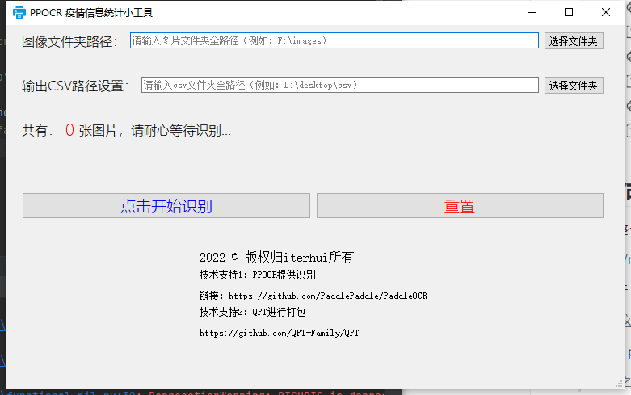
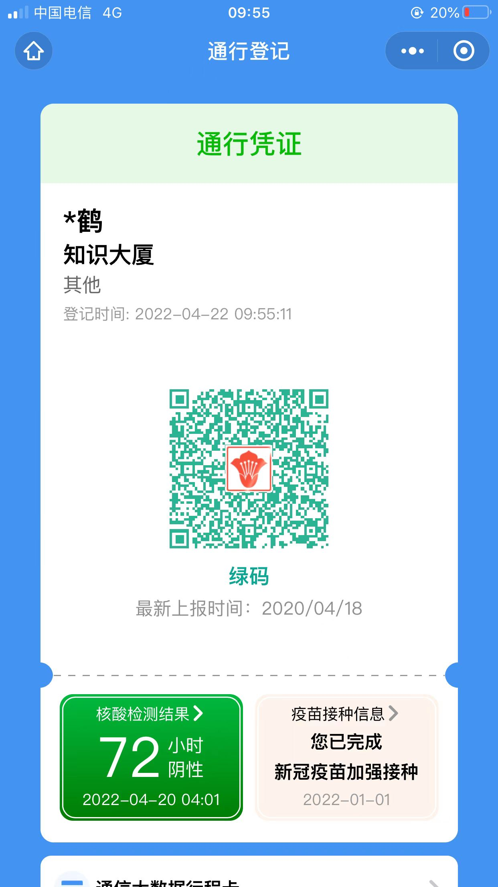
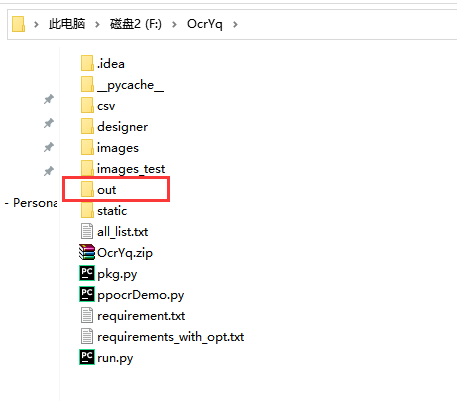
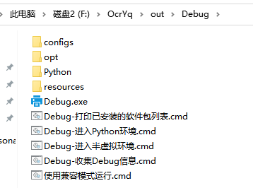
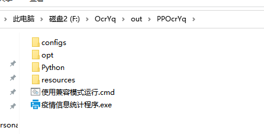

# [疫情信息统计进阶篇]PPOCR和QPT的落地实战 
**---------------------------------------------------OCRandQPTandIS---------------------------------------------------**

**Covid-19 outbreak information statistics**


> [疫情信息统计进阶篇]PPOCR和QPT的落地实战    
> 项目地址：[https://aistudio.baidu.com/aistudio/projectdetail/3877807](https://aistudio.baidu.com/aistudio/projectdetail/3877807)   

> [PaddleOCR]核酸检测证明复查统计？50行代码轻松搞定    
> 项目地址：[https://aistudio.baidu.com/aistudio/projectdetail/3779297](https://aistudio.baidu.com/aistudio/projectdetail/3779297)  

继上篇说起，完成了ocr的核酸检测信息统计

这次主要来搞搞，如何落地实践。

项目已经放置数据集中，开箱即可使用，因为设计界面制作，请您在本地环境使用。

## 0 先看效果 ~

截图展示：

> 软件打包后运行效果：


> 截图展示：



B站视频地址：
[https://www.bilibili.com/video/BV1Hr4y1J7cR](https://www.bilibili.com/video/BV1Hr4y1J7cR)


## 1 解压文件


```python
!unzip -oq /home/aistudio/data/data141663/OcrYq.zip -d work/
```

## 2 文件介绍


## 3 如何使用

1. 将整个项目下载到本地之后，安装

> work/requirement.txt 中的所以依赖，可能不全，自己看情况导入

2. 运行 run.py 本地项目预览
> 正常这已经可以了

3. 运行pkg.py 打包工具
> 运行之后既可在文件夹中发现out目录，根据QPT的描述进行使用即可。

## 4 QPT 打包详解

1. 首先认准官方链接不迷路：
> [QPT官方链接](https://github.com/QPT-Family/QPT)
2. 找到README.MD中的快速使用(戳他)
> [QPT-快速使用](https://github.com/QPT-Family/QPT#%E5%BF%AB%E9%80%9F%E4%BD%BF%E7%94%A8)
> 这里我们可以看到，QPT提供了两种打包方式，撰写打包脚本（推荐）和使用命令打包
>
> 
3. 推荐的是打包脚本，那咱们就直接用脚本，直接按照流程开搞
实现的脚本可见项目源码中的
> pkg.py
```python
# 导入QPT
from qpt.executor import CreateExecutableModule as CEM
from qpt.modules.python_env import Python38

def main():
    module = CEM(work_dir="F:/OcrYq",
                 launcher_py_path="F:/OcrYq/run.py",
                 save_path="./out",
                 requirements_file="auto",
                 hidden_terminal=False,
                 interpreter_module=Python38(),
                 icon="F:/OcrYq/static/favicon.ico")
    # 开始打包
    module.make()


if __name__ == "__main__":
    main()
```
> PS:
> 1. 就没见过这么详细的注释好吧?不管是代码的注释以及运行过程中的输出，为了小白使用操碎了心，何况还有[GT](https://github.com/GT-ZhangAcer)这位随时的答疑机器人[手动狗头]
> 2. 其中：官方的python解释器是python37的，可以根据你自己的版本进行更换，这个也就改个数的问题，洒洒水就解决了。

4. 运行之后，可以看到

 

没错，就是这个out文件夹，里面就会出现两个文件夹
> 1. Debug
>
>    
> 在你前面运行脚本时，注意看终端的输出，有介绍，Debug适合在你本机进行判断,exe是否可用
>
> 2. Release (这里叫PPOcrYq是我自己改名了，打包发送给别人个Release不太合理吧哈哈)
>
>    
> 把这个文件夹改成你想要的名字，压缩，发给你的小伙伴，运行！OVER！


## 5 实现讲解以及后续提升

**实现：**

1. 首先，肯定是ocr检测的实现，这个直接使用PPOCR的接口即可，但没有采用GPU，方便打包用户使用。
2. 对于检测得到的文本，有针对性的根据数据的特点去保存，但无法做到普适所有的疫情信息图片，这点是缺点。
3. 界面的编写，这里采用PyQt5进行实现，QT designer的界面化使得开发简单了许多，只需要合理使用信号与槽即可完成代码编写。
4. 对于界面的未响应，使用多线程来解决线程的阻塞，进而增加一点用户体验。

**提升：**

1. 由于仅仅花费了几天的时间自学PyQT，界面还需要优化，提升用户体验。
2. OCR没有进行训练，只是采用的接口快速实现，会存在识别不准的情况，但目前来看相对还好。
3. 界面中应该有进度提示，或者是文本流动，增加用户感观体验。
4. 没有采用GPU，很慢，识别起来很慢，200张图片需要15分钟。 


## 5 个人总结

全网同名：

> iterhui

我在AI Studio上获得至尊等级，点亮10个徽章，来互关呀~

> [https://aistudio.baidu.com/aistudio/personalcenter/thirdview/643467](https://aistudio.baidu.com/aistudio/personalcenter/thirdview/643467)
